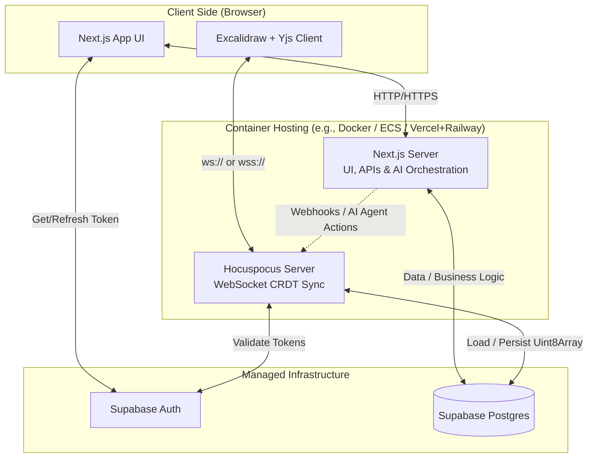
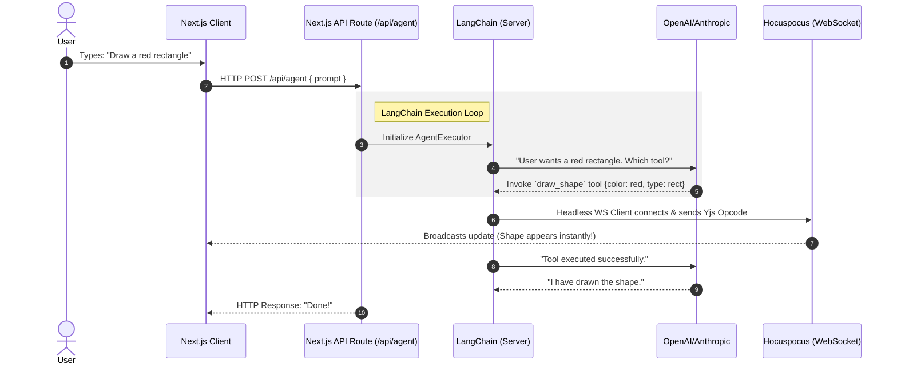

# AI Powered Canvas

## Architecture



## User Interaction & Sync Sequence

````mermaid
sequenceDiagram
  autonumber
  actor User
  participant Client as Browser (Next.js + Excalidraw)
  participant Auth as Supabase Auth
  participant Hocus as Hocuspocus Server
  participant DB as Supabase Postgres

  User->>Client: Navigates to /room/123
  Client->>Auth: Request Session
  Auth-->>Client: Returns JWT

  Client->>Hocus: Upgrade to WebSocket (Sends JWT)

  rect rgba(128, 128, 128, 0.1)
    note right of Hocus: Hocuspocus Lifecycle Hooks
    Hocus->>Auth: onAuthenticate: Verify JWT
    Auth-->>Hocus: Validated
    Hocus->>DB: onLoadDocument: Fetch existing binary state
    DB-->>Hocus: Returns Uint8Array (or null)
  end

  Hocus->>Client: Sync Step 1 (Server State Vector)
  Client->>Hocus: Sync Step 2 (Client missing ops)

  User->>Client: Draws a rectangle
  Client->>Hocus: Sends binary update frame (Opcode 0x2)
  Hocus->>Hocus: Merges into RAM & Broadcasts to peers

  note over Hocus, DB: Silence for 2 seconds (Debounce)
  Hocus->>DB: onStoreDocument: Upsert compressed Uint8Array```
````

## Agent



## Data Model

````mermaid
classDiagram
  class Canvas {
    +String roomId
    +Map~String, Element~ elements
  }

  class Element {
    <<Interface>>
    +String id
    +String type
    +Float x
    +Float y
    +Float width
    +Float height
    +Style style
  }

  class Node {
    +String textContent
  }

  class Edge {
    +String sourceId
    +String targetId
  }

  class Style {
    +String stroke
    +String fill
    +Float strokeWidth
  }

  Canvas "1" --> "many" Element : contains
  Element <|-- Node : implements
  Element <|-- Edge : implements
  Element "1" --> "1" Style : uses
  Edge --> Element : connects (via IDs)```
````
